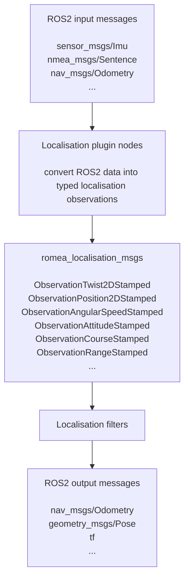

# romea_localisation_msgs

`romea_localisation_msgs` defines the ROS2 messages exchanged between ROMEA localisation plugins and localisation filters.

The package does not implement any algorithm. It provides the common message types used to express localisation observations and localisation status. The conversion helpers are provided by `romea_localisation_utils`, while the filter node is provided by `romea_robot_to_world_localisation_core`.

## 1) Concept

The localisation stack uses common ROS2 messages at its boundaries and ROMEA observation messages between plugins and filters:

Each plugin converts one standard ROS2 sensor or controller stream into one or more `romea_localisation_msgs` observations. Localisation filters subscribe to these observations, fuse them and publish results using standard ROS2 outputs when possible, for example filtered odometry and transforms for robot-to-world localisation.

## 2) Observation Messages

Observation messages are available in two forms:

* a payload message that contains the measured quantity and its uncertainty;
* a stamped message that adds a `std_msgs/Header`.

The stamped form is the one normally exchanged on ROS2 topics.

| Stamped message | Payload | Typical producer |
| --- | --- | --- |
| `ObservationTwist2DStamped` | `ObservationTwist2D` | Odometry localisation plugin |
| `ObservationAngularSpeedStamped` | `ObservationAngularSpeed` | IMU localisation plugin |
| `ObservationAttitudeStamped` | `ObservationAttitude` | IMU localisation plugin |
| `ObservationPosition2DStamped` | `ObservationPosition2D` | GPS or RTLS localisation plugin |
| `ObservationCourseStamped` | `ObservationCourse` | GPS localisation plugin |
| `ObservationPose2DStamped` | `ObservationPose2D` | Pose plugin, for example lidar, radar or RTLS |
| `ObservationRangeStamped` | `ObservationRange` | RTLS range localisation plugin |

## 3) Observation Content

The observation payloads carry compact 2D localisation information and the uncertainty associated with each observation. Depending on the measured quantity, this uncertainty is represented as a standard deviation, a variance/covariance matrix, or a covariance embedded in a `romea_common_msgs` type.

| Message | Measurement | Uncertainty |
| --- | --- | --- |
| `ObservationTwist2D` | Robot planar twist and lever arm | Covariance in `romea_common_msgs/Twist2D` |
| `ObservationAngularSpeed` | Yaw angular speed | Standard deviation |
| `ObservationAttitude` | Roll and pitch angles | Covariance |
| `ObservationPosition2D` | 2D position and lever arm | Covariance in `romea_common_msgs/Position2D` |
| `ObservationCourse` | Course angle | Standard deviation |
| `ObservationPose2D` | 2D pose and lever arm | Covariance in `romea_common_msgs/Pose2D` |
| `ObservationRange` | Range and antenna positions | Range standard deviation |

The `level_arm` fields describe the position of the physical measurement point with respect to the localisation body frame. For example, a GPS observation is measured at the antenna position, not directly at the robot control point.

## 4) Localisation Status

`LocalisationStatus` represents the current state of a localisation process:

| Value | Meaning |
| --- | --- |
| `INIT` | The localisation process is being initialised |
| `RUNNING` | The localisation process is running |
| `RESET` | The localisation process has been reset |
| `ABORTED` | The localisation process has stopped because it cannot provide a valid estimate |

This status is used by localisation nodes and helpers to expose the state of the filter lifecycle.

## 5) Notes

Only the message interfaces listed in `CMakeLists.txt` are currently generated by this package.

## License

This project is released under the Apache License 2.0.

## Authors

This package was developed by Jean Laneurit.
